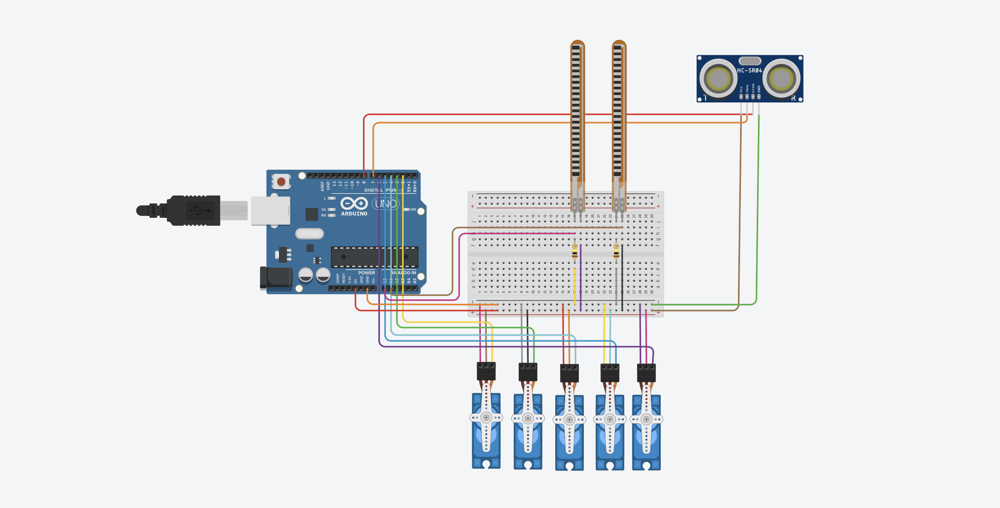

# Robotic Hand: Rock-Paper-Scissors

An interactive robotic hand that mimics human gestures and plays Rock-Paper-Scissors in real time.

## Project Background

This project was developed during my Erasmus+ stay at Universidad San Jorge in Spain. As part of a course assignment, we were asked to create a project using the sensors and motors provided. Using only 2 flex sensors, an ultrasonic sensor, 5 servo motors, and readily available materials from local stores, I designed and built this interactive robotic hand capable of playing Rock-Paper-Scissors and mimicking hand gestures. Despite the minimal setup, the project demonstrates real-time gesture detection, decision-making, and robotic control.

## Features
- 5 servo motors to control each finger individually
- Uses 2 flex sensors on the index and ring fingers, which is the optimal setup for detecting gestures for Rock-Paper-Scissors
- An additional 5 flex sensors would be needed to fully mimic all finger movements, but they are not required for the game mode
- Ultrasonic sensor starts the game when a hand is detected (~20 cm)
- Two modes:
  - **Hand Mimic Mode**: The robot mimics your hand gestures. *(Code for this mode will be added soon.)*
  - **Game Mode**: The robot plays Rock-Paper-Scissors with the user
- Serial Monitor displays both moves and the winner of each round

## Hardware Requirements
- Arduino board (Uno or compatible clone)
- 5x Servo motors
- 2x Flex sensors (5x for Hand Mimic mode)
- 2x 100 kΩ Resistor (5x for Hand Mimic mode)
- 1x Ultrasonic sensor (HC-SR04)
- Jumper wires, breadboard, and power supply

## Wiring / Schematics

- Flex sensors: index → A0, ring → A1
- Servo pins: thumb → 2, index → 3, middle → 4, ring → 5, pinky → 6
- Ultrasonic sensor: trig → 7, echo → 8

*Figure: Wiring and circuit diagram for the robotic hand*

## Usage
1. Open `RoboticHandRPS.ino` in Arduino IDE
2. Connect your Arduino and upload the code
3. Place your hand ~20 cm above the ultrasonic sensor to start the game
4. Observe moves and results on the Serial Monitor

## Notes
- **Flex Sensor Calibration**: Adjust `flexThreshold` depending on your sensors. Use the Serial Monitor to read raw values. Bent fingers should read above the threshold, straight fingers below.
- **Servo Position Adjustment**: Adjust `open` and `closed` angles for smooth and complete finger movements. Test each finger individually to find the optimal positions.
- **Flex Sensor Setup**: 2 flex sensors (index and ring fingers) are sufficient for Rock-Paper-Scissors game mode. To fully mimic all finger movements in hand mimic mode, 5 flex sensors would be required.

